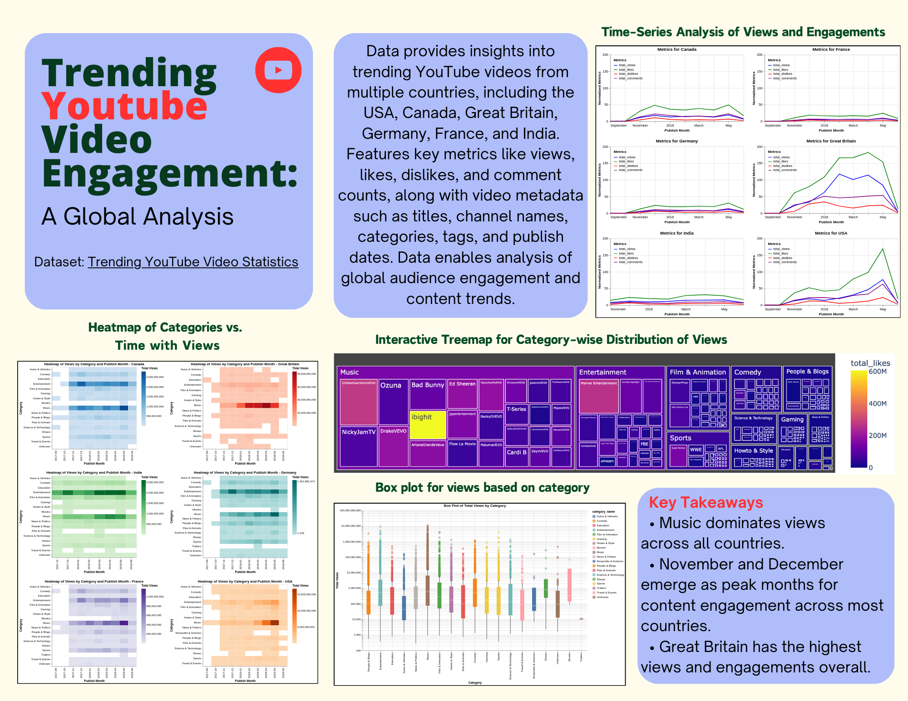

# Trending YouTube Video Engagement: A Global Analysis  

## Introduction  
This project explores and visualizes global trends in YouTube video engagement. It provides insights into the dynamics of trending videos across various countries. Key goals include:  
- Understanding how views, likes, comments, and other metrics vary by country.  
- Identifying factors contributing to a video’s popularity.
- uncover patterns in user engagement.
- 

## Dataset  
**Source:** [Kaggle - Trending YouTube Video Statistics](https://www.kaggle.com/datasets/datasnaek/youtube-new)  

This dataset captures trending YouTube videos across multiple countries, including the United States, Canada, Great Britain, Germany, France, and India. It spans various metrics and metadata about videos that trended between late 2017 and mid-2018.

The dataset includes:  
- Metadata on trending YouTube videos (titles, tags, and descriptions).  
- Engagement metrics like views, likes, dislikes, and comments.  
- Country-specific trends.  

## Exploratory Analysis

Key steps include:
- Data preprocessing and cleaning
- Aggregation of metrics across countries
- Analysis of tags and descriptions
- Visualization of trends over time

## Visualizations  

### Heatmap  
Analyzes YouTube viewing patterns across six countries (2017-2019). Darker colors indicate higher views, with the USA leading in Entertainment and Music categories. This visualization reveals regional preferences and temporal trends.  

### Time Series  
Line graphs track engagement metrics (views, likes, dislikes, comments) across six countries. Great Britain and the USA show the highest activity, with notable spikes in 2017-2018. India displays steady engagement from mid-2018.  

### Box Plot  
Displays the distribution of views across content categories on a logarithmic scale. Music, Entertainment, and Gaming dominate viewership, while educational content shows stable performance. Variability and outliers highlight trends within categories.  

### Treemap  
Visualizes channel performance by category, with rectangle size representing views and color indicating likes. Music leads with channels like NickyJamTV and T-Series, followed by Entertainment and mid-sized categories like Film & Animation.  

## Key Insights  

1. **Regional Preferences**:  
   - The USA leads in YouTube engagement, particularly in Entertainment and Music categories.  
   - Great Britain and Germany show strong interest in educational content.  

2. **Engagement Trends**:  
   - Great Britain and the USA display the highest engagement, with notable spikes in activity.  
   - India exhibits consistent but lower engagement levels from mid-2018.  

3. **Content Popularity**:  
   - Music dominates in viewership, followed by Entertainment and Gaming.  
   - Educational content maintains stable, moderate viewership.  
   - Smaller categories like Nonprofits & Activism and Travel & Events show steady but limited engagement.  

4. **Channel Performance**:  
   - Music channels consistently attract the highest views and likes, led by major channels like NickyJamTV and T-Series.  
   - Entertainment channels display strong but distributed performance across diverse creators.  

5. **Variability and Outliers**:  
   - Significant variability exists within categories like Music and Entertainment, with outliers achieving exceptionally high views.  
   - The logarithmic scale reveals disparities in viewership across both niche and popular content.
